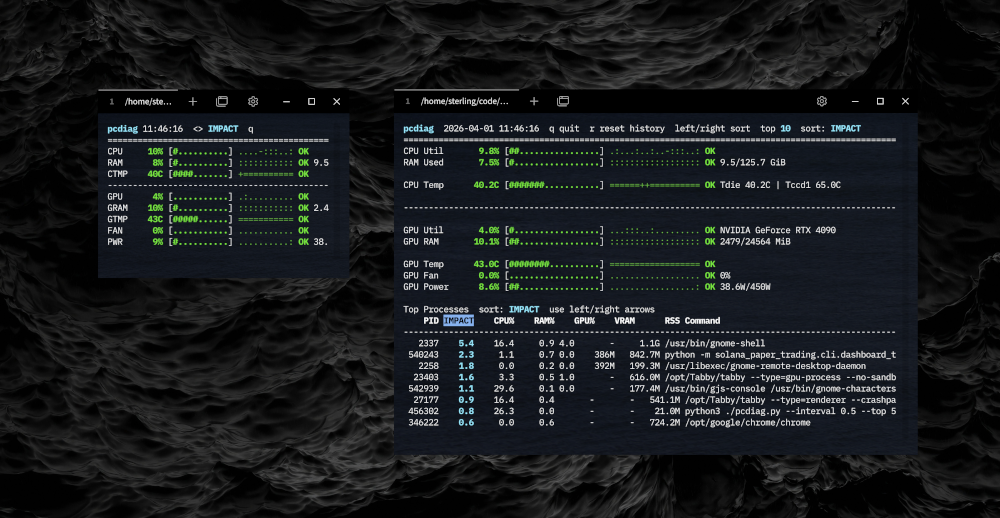

# systemviz

Small terminal dashboard for Ubuntu that keeps the main thermal and usage signals on one screen:



- GPU utilization
- GPU memory used percent
- GPU temperature
- GPU fan speed and power draw/limit when the NVIDIA driver exposes them
- CPU utilization
- CPU temperatures, with `Tdie` and `Tccd1` surfaced when available
- RAM used percent
- Top processes by current CPU, RAM, GPU, and VRAM impact

## Run

```bash
cd path/to/systemviz
./systemviz.py
```

## Install

User-local install:

```bash
cd path/to/systemviz
./install_systemviz.sh
systemviz
```

Optional global install:

```bash
cd path/to/systemviz
sudo ./install_systemviz.sh --global
systemviz
```

If you prefer the installed command to keep tracking the repo file instead of copying it:

```bash
./install_systemviz.sh --symlink
```

Useful flags:

```bash
./systemviz.py --interval 0.5
./systemviz.py --history 120
./systemviz.py --top 15
./systemviz.py --snapshot
```

Controls in the live view:

- `q` quits
- `r` clears the history graphs
- `left` and `right` arrows change the process-table sort column

## Temperature status

- CPU temperature status uses `Tdie` when available and falls back to the best available CPU package reading
- GPU temperature status uses the NVIDIA driver-reported thermal limit when available

## Data sources

- CPU and RAM come from `psutil`
- CPU temperatures come from Linux hwmon sensors via `psutil`
- GPU stats come from `nvidia-smi`

## Notes

- Narrow terminals automatically switch to a compact layout
- Per-process GPU percent comes from `nvidia-smi pmon`
- Per-process VRAM is only available for processes `nvidia-smi` reports through the compute-apps query, so some desktop graphics processes may show GPU percent without a VRAM number
